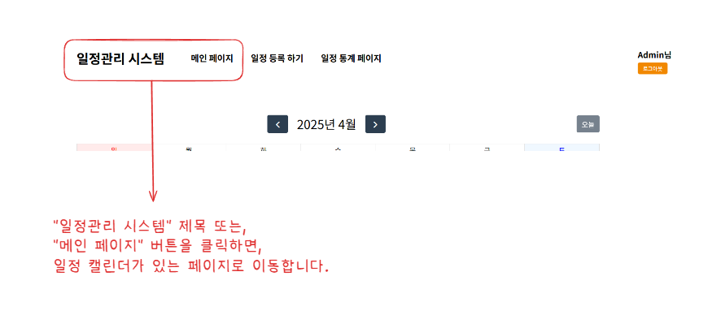

# 프로젝트 설명

사내 직원들의 일정관리를 위한 시스템입니다.

직원 별로 본인 만의 일정을 캘린더에 등록하고 관리할 수 있습니다.

또한, ```일정 복사``` 기능을 통해 기존 일정을 토대로 신규일정을 만들 수 있는 편리성을 제공합니다.

관리자는 등록된 직원들의 모든 일정을 조회 및 관리하며, 통계 페이지를 통해 일정에 대한 현황을 확인할 수 있습니다.

# 설치 및 실행방법

- 프로젝트를 Clone합니다.
```shell
git clone https://github.com/J-HyeonSeo/Calendar_System.git
```
- Clone한 git프로젝트에 진입합니다.
```shell
cd Calendar_System
```

- Docker Image를 빌드하고, MySQL과 같이 Container를 Compose하여 배포합니다.
```shell
sh projectStart.sh
```

- 배포된 Local환경의 주소로 접근합니다.
```
http://localhost:7777
```

# 사용법 메뉴얼 (공통)
- 로그인


- 회원가입


- 로그아웃


- 메인(캘린더) 페이지 진입


- 일정 등록


- 일정 상세 조회/수정/삭제/복사


# 사용법 메뉴얼 (관리자)

- 일정 통계 조회

